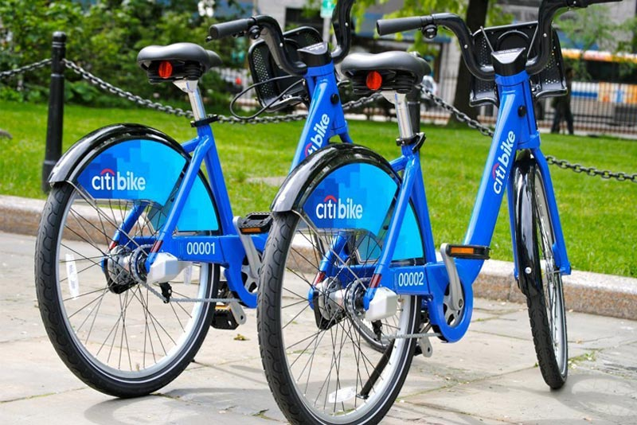
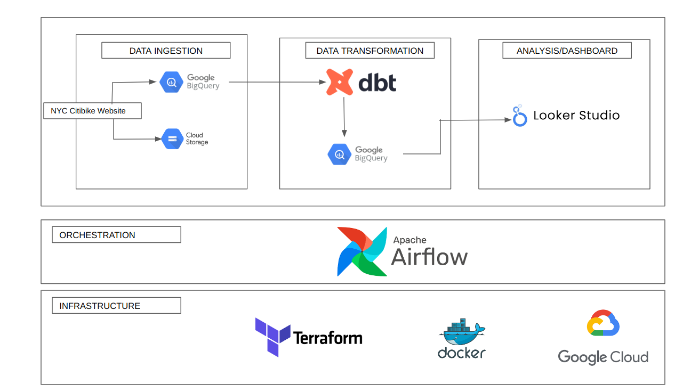
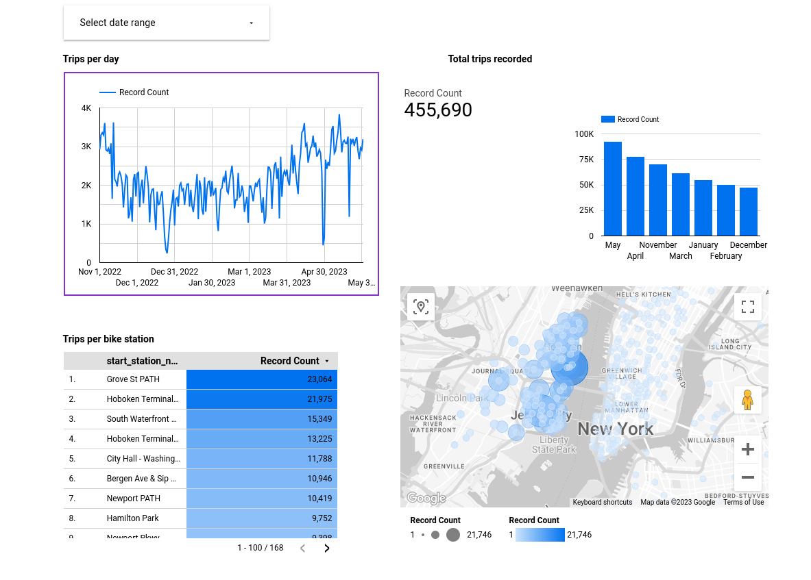

# NYC Bike project
<p align="center">

</p>

## Objective
The aim of this project was to come up with a complete ETL pipeline, meaning including data extraction, transformation as well as ingestion. And the data we worked with was related to citibike which is a company having a public bike shaing system in New York City in USA. So the aim was to design an entire data pipeline, with data for each being downloaded from citibike website([data](https://s3.amazonaws.com/tripdata/index.html)), then uploaded into GCS before some transformation being applied to it usin DBT and finally some usefull visualization being obtained using Google Locker Studio.


## Architecture
<p align="left">

</p>

## Problem statement
The work was devoted to answering the following questionsw: Where do Citi bikers ride? When do they ride? How far do they go? Which stations are most popuplar? What days of the week are most popular?


## Dataset description
The dataset has the following columns:
- ride_id: contains information related to a unique identifier associated with each ride			
- rideable_type: has information related to types of bikes being used for the ride					
- started_at: start time of the ride					
- ended_at: ride end time					
- start_station_name: start station name					
- start_station_id: id associated with each station					
- end_station_name: end station name					
- end_station_id: id associated with ecah stsation						
- start_lat: latitude associated with the trip starting position					
- start_lng: longitude associated with the trip starting position					
- end_lat: latitude associated with the trip ending position					
- end_lng: longitude associated with the trip ending position					
- member_casual: type of users using the bikes					


## Proposal

### Technologies
## What technologies are being used?
- Cloud: [Google Cloud](https://cloud.google.com)
- Infrastructure: [Terraform](https://www.terraform.io/)
- Orchestration: [Airflow](https://airflow.apache.org/)
- Data lake: [Google Cloud Storage](https://cloud.google.com/storage)
- Data transformation: [DBT](https://www.getdbt.com/)
- Data warehouse: [BigQuery](https://cloud.google.com/bigquery)
- Data visualization: [Google Looker Studio](https://cloud.google.com/looker)


### Repository organization
- \airflow:  flows files.  
#- \images: pictures.
- \dbt: dbt files (dbt_project.yml, models, etc.).
- \terraform: terraform files for the definition of the infrastructure to deploy.  
- \GCP_setup.md: instructions to configure cgp account.
- \README.md: this document. 
  

**Infrastructure as code:**  

Use Terraform to create a bucket GCS and dataset in BQ  
- citibike_nyc bucket to store parquet files.
- raw dataset for the ingestion into BigQuery.
- development dataset for dbt cloud development environment.
- production dataset for dbt cloud production environment.

  **Orchestration:**  


**Transformations using dbt:**  
 Use dbt cloud to perform joins and aggregations on BQ.  
  - Staging (materialized=view):  
    - New Yoek City rides information: Create staged model from citibike_tripdata table in Big Query.  
    - The output will be `stg_tripdata` model with the distance travelled being added as well as the latitude and longitude columns being concatenated.  
       
  - Core (materialized=table):
    - `fact_trips` materialized model by `stg_tripdata` model. 
   
  - Job:
    - For the convenient creation of the production dataset, a job `dbt build` will be created.
    - This job can be run manually (or scheduled) from dbt cloud.

    **Dashboard:**    
 

  
  Connect Google Data Studio to BQ dataset and design dashboard  

  ## Results

**Dashboard**
<p align="left">

</p>
You can check my dashboard here:
https://lookerstudio.google.com/s/iCKaAhBrFg0

## Setup and running
Airflow will run as docker container.
For data transformation:  
Dbt cloud will be used to perform data transformation pipeline.  
  
Your gcp account will be used and, unless you have google's welcome credit, it will have some cost.
Your dbt cloud account will be used. Developer account is free.

If you wish to install the required tools in your own machine the instructions in `setup_gcp.md` will be a good starting point.

### Run pipelines
1. Setup your Google Cloud environment
- Create a [Google Cloud Platform project](https://console.cloud.google.com/cloud-resource-manager)
- Configure Identity and Access Management (IAM) for the service account, giving it the following privileges: BigQuery Admin, Storage Admin and Storage Object Admin
- Download the JSON credentials and save it, e.g. to `~/.gc/<credentials>`
- Install the [Google Cloud SDK](https://cloud.google.com/sdk/docs/install-sdk)
- Let the [environment variable point to your GCP key](https://cloud.google.com/docs/authentication/application-default-credentials#GAC), authenticate it and refresh the session token
```bash
export GOOGLE_APPLICATION_CREDENTIALS=<path_to_your_credentials>.json
gcloud auth activate-service-account --key-file $GOOGLE_APPLICATION_CREDENTIALS
gcloud auth application-default login
```
2. Install all required dependencies into your environment
```bash
pip install -r requirements.txt
```
3. Terraform
`cd terraform`
`terraform init`
`terraform plan -var="project=<your-gcp-project-id>"`
`terraform apply -var="project=<your-gcp-project-id>"`


```
